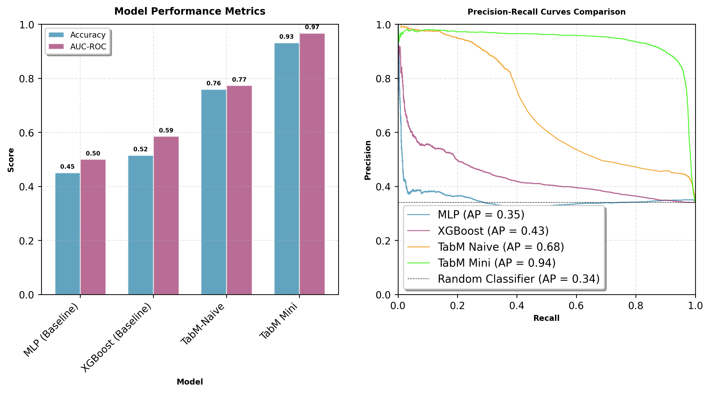

# paper-tabm

WIP Implementation of TabM paper : https://arxiv.org/abs/2410.24210

## Models :

| Name                            | Comment                                                          | Status |
| :------------------------------ | :--------------------------------------------------------------- | :------|
| $\mathrm{XGBoost}$              | Baseline - [XGBoost](https://xgboost.readthedocs.io/en/stable/)  |   ✅   |
| $\mathrm{MLP}$                  | The plain multilayer perceptron (MLP)                            |   ✅   |
| $\mathrm{MLP^\dagger}$          | MLP with the piecewise-linear embeddings                         | to-do  |
| $\mathrm{TabM_{Naive}}$         | TabM naive                                                       |   ✅   |
| $\mathrm{TabM_{mini}}$          | TabM mini                                                        |   ✅   |
| $\mathrm{TabM}$                 | TabM Full                                                        | to-do  |
| $\mathrm{TabM^\dagger}$         | TabM with the piecewise-linear embeddings                        | to-do  |

## Results

